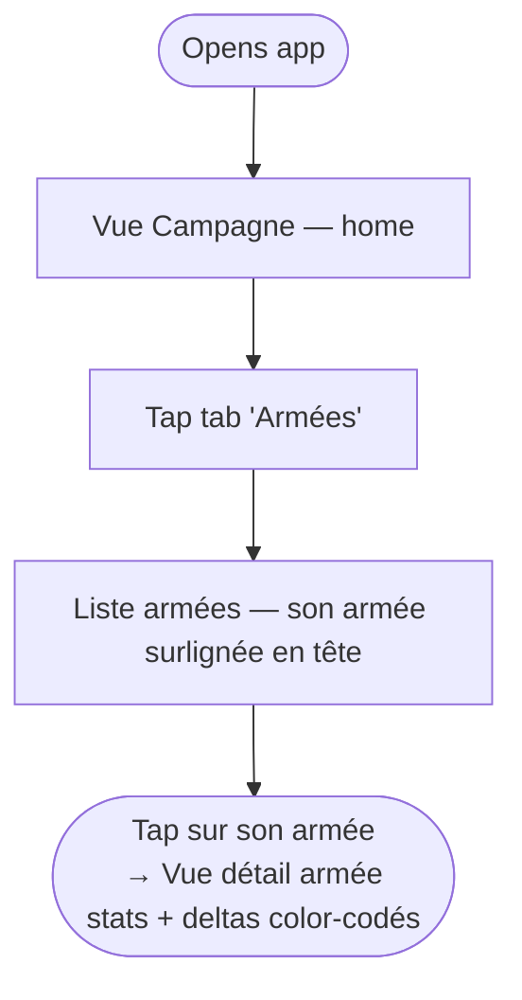
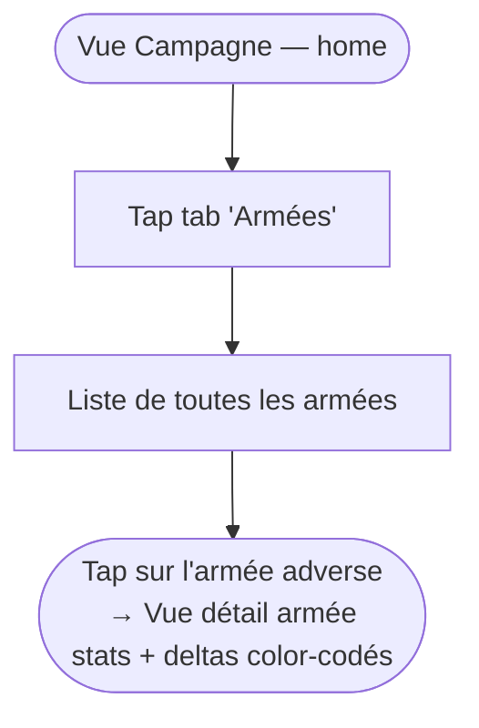
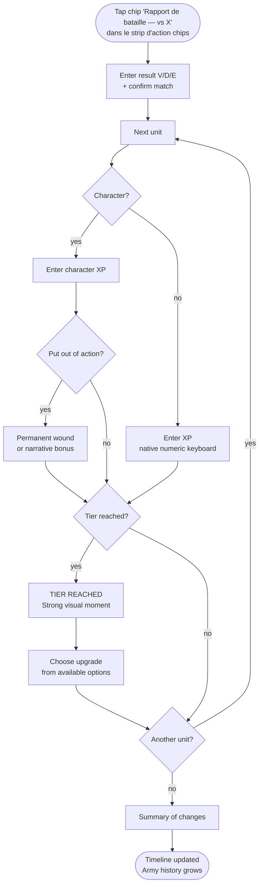
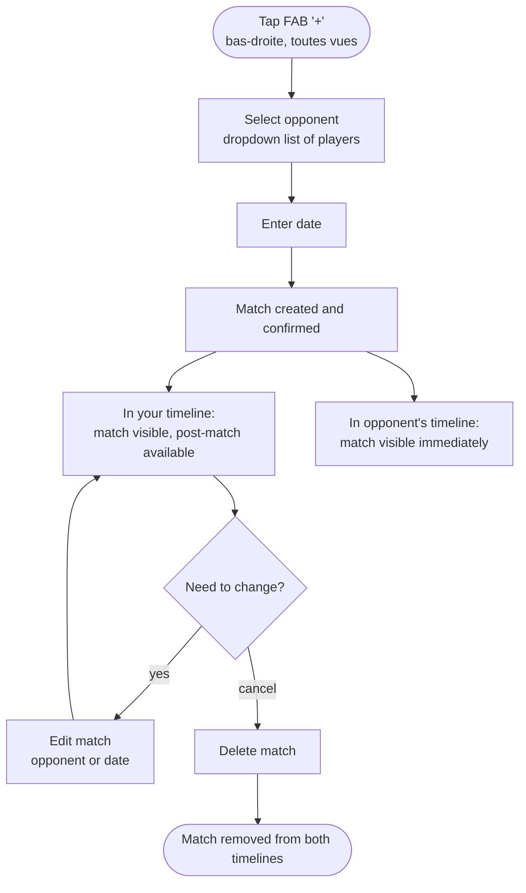

# User Journey Flows

## J2 — Army Consultation at the Table

**Own army — 2 taps (primary path)**

**Opponent army — 2 taps**

## J1 — Post-Match Flow

## J_invite — Match Creation

## Journey Patterns

- **Two-tap access**: own army always reachable in 2 taps — tab "Armées" → tap own army (highlighted gold)
- **Single entry for opponents**: tab "Armées" → tap opponent army — one consistent path
- **FAB action**: match creation always available via FAB, never confused with navigation
- **Non-blocking pending state**: incomplete post-matchs surface as action chips, never block other actions

## Flow Optimization Principles

- No result entry at match creation — entered at post-match start when context is clearest
- No opponent confirmation step — match is confirmed on creation, visible in both timelines immediately
- Army view is the terminal screen for consultation — no drill-down to individual unit sheet needed
- Post-match flow is sequential unit by unit — one decision at a time, no form to fill

---
